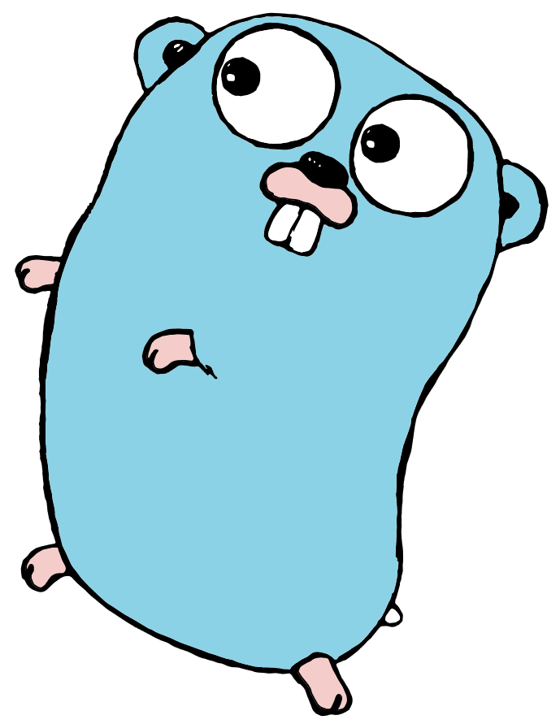
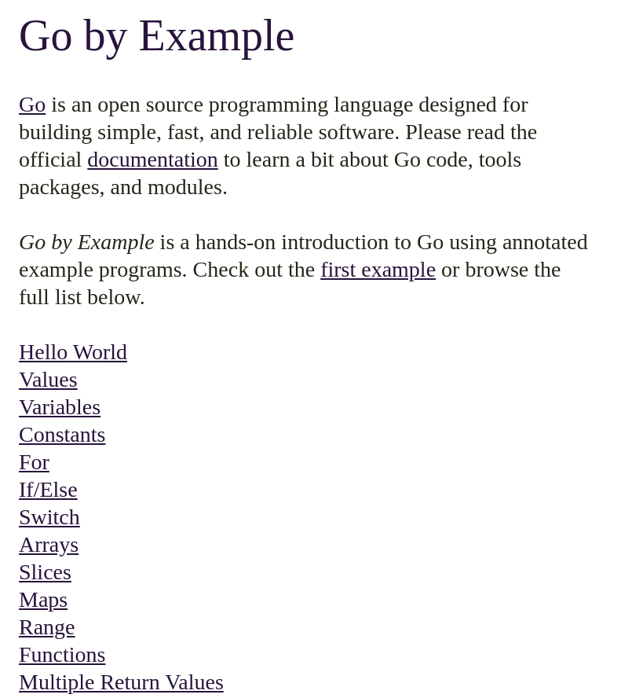
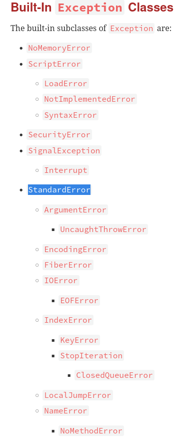
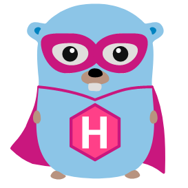

# Slides & Resources

\large https://github.com/unused/rubyists-lets-go/

# Go Programming Language

\vspace{2.5cm}
\center


# What is it good for?

`script < command < application`

# Are we on the same page?

Go vs Ruby

- Easy to Learn vs Easy to Read

- Statically Typed vs Duck Typed

- Compiled to Cross-Platform, and not

- Both: Nice Community, Much Packages

- Testing (and Documentation) is a Good Practice

# Learn Go

::: columns

:::: column

- Go by Example

- Tour of Go

- Effective Go

::::

:::: column



::::

:::

# Projects Starter

Much improved `go-mod`, but no `bundler` yet.

```sh
# creative project names,
# include "go" if you can
$ go mod init github.com/unused/gorgonzola
```

# Packages by Directory

before proper tooling: `$GO_PATH/src/github.com/unused/gorgonzola/`

```sh
$ bundle info sinatra | grep Path
/home/me/.../vendor/bundle/ruby/3.2.0/gems/sinatra-3.0.5
```

\spacer

```sh
$ ls -R gorgonzola/
  go.mod # your Gemfile and Gemfile.lock
  main.go
  user.go
  utils/ # that's package: [...]/gorgonzola/utils
    calculator.go
  vendor/ # go-mod vendor like bundle config path
```

# Load Directory in Ruby

```ruby
# import "github.com/unused/gorgonzola"
# gorgonzola.GetCheese()

# app/* | module App
#   controllers/* | module App::Controllers
#     concerns/* | module App::Controllers::Concerns
def import(path)
  Dir.glob("#{path}/*.rb") do |file|
    require_relative file
  end
end
```

aka [conventional file structure (Zeitwerk)](https://github.com/fxn/zeitwerk#file-structure)

# Defer Go

```go
func write(filename, body string) {
    f, _ := os.Create(filename)
    defer f.Close()
    f.WriteString(body)
}
```

# Defer Go and Ruby

```go
func write(filename, body string) {
    f, _ := os.Create(filename)
    defer f.Close()
    f.WriteString(body)
}
```

\vspace{1cm}

```ruby
def write(filename, body)
  file = File.open(filename, 'w')
  file.write body
  file.close
end
```

# Defer Ruby Block

```ruby
def write(filename, body)
  file = File.open(filename, 'w') do |file|
  file.write body
  file.close
end
```

\vspace{1cm}

```ruby
def write(filename, body)
  File.open(filename, 'w') do |file|
    file.write body
  end
end
```

# Defer Go in Good Style

```go
// write writes body to a file named filename
func write(filename, body string) error {
    f, err := os.Create(filename)
    if err != nil {
        return err
    }
    defer f.Close()

    return f.WriteString(body)
}
```

# Errors, Lightweight Exceptions

::: columns

:::: column
```ruby
# Create a custom error class
class TriedStupidStuffError \
    < StandardError; end

msg = 'You miss stuff'
raise ArgumentError.new msg

# I'll take care, relax...
def rescue_from
  yield
rescue ArgumentError => err
  @logger.warn err
ensure
  run_after_callbacks
end
```
::::

:::: column

::::

:::


# Errors

```go
err := json.Unmarshal(byt, &dat)
if err != nil {
    return nil, err
}
return dat, nil

// or


if err := json.Unmarshal(byt, &dat); err != nil {
    return nil, err
}
// continue
```

<!--
Exceptions, something like that exists, but is discouraged. Use safe error
handling instead.
-->

# Errors (for this example)

```go
// for this example...
func fromJson(res []byte) (*dat Response, error) {
    var dat Response
    err := json.Unmarshal(res, &dat)
    return &dat, err
}
```

# (Naming) Conventions in Language Design

`myFunc` vs `MyFunc`

\spacer

```go
package main

import "fmt"

func main() {
  const name, age = "Kim", 22
  fmt.Println(name, "is", age, "years old.")
}
```

# Extend Types

```go
type Rect struct {
  Width  int
  Height int
}

func (r *Rect) Area() int {
    return r.Width * r.Height
}
```

# Interfaces

```go
type Rect struct {
  //..
}
func (r *Rect) Area() int {
  // ...
}
```

\spacer

```go
type Geometry interface {
  Area() int
}

```

# Count Server Example 0

```md
A HTTP server that responds with a incremented
counter with every visit.

# Usage

$ ./counter-server # starts server at port 6301
```

# Count Server Example I

```go
package main

import (
	"fmt"
	"net/http"
)

// Server provides a counter that is increased
// with every visit.
type Server struct {
	Count int
}
```

# Count Server Example II

```go
// ServeHTTP is the expected interface method to
// make server an HTTP handler.
func (s *Server) ServeHTTP(w http.ResponseWriter,
                           req *http.Request) {
	s.Count = s.Count + 1
	fmt.Fprintf(w, "%d\n", s.Count)
}

func main() {
	handler := Server{Count: 0}
	http.ListenAndServe(":6301", &handler)
}
```

# Count Server Example III

```bash
$ go run count-server.go &

$ curl http://localhost:6301
1
$ curl http://localhost:6301
2
$ curl http://localhost:6301
3
```

# Ruby Count Server Example

```ruby
require 'sinatra'

counter = 0

get '/' do
  "#{counter += 1}\n"
end
```

# Rubocop Ships with Language Tooling

```sh
$ go help cmd/gofmt
Gofmt formats Go programs...

$ go help cmd/vet
Vet examines Go source code and reports suspicious...
```

# Embrace Spaghetti

::: columns
:::: column
Ruby is Developer Happiness
::::
:::: column
Go is Happy Developer
::::
:::

# Use Ruby and Go (Trust a Rubyist)

- handy for devops and system tasks

- fun to work with

- does kind of duck typing

- conventions make the rubyists eye only cry a little

- has a bundler and rubocop on-board

- has focus on testing and docs

- has nice community, much packages

- more to explore: goroutines & channels

# In the Wild

::: columns
:::: column

- Hugo <!-- static site gen. -->
- Kubernetes <!-- orchestration thingy -->
- Docker <!-- container toolset -->
- ngrok <!-- tunnel service -->
- influxDB <!-- time series db -->
- fzf <!-- fuzzy finder -->
- esbuild <!-- js build -->
- Jaeger <!-- tracing -->
- Anycable <!-- actioncable alternative -->

::::
:::: column

- Grafana <!-- dashboards -->
- etcd <!-- distr. key-value store -->
- traefik <!-- proxy -->
- vault <!-- secrets mgmt -->
- Drone <!-- CI -->
- CockroachDB <!-- distributed SQL -->
- trivy <!-- security scanner -->
- CoreDNS <!-- dns -->
- ...

::::
:::

# ...and don't forget the gopher

::: columns
:::: column

{width=2.5cm}

{width=2.5cm}

::::
:::: column

{width=2.5cm}

{width=2.5cm}

::::
:::


# Resources

\small https://github.com/unused/rubyists-lets-go

\spacer

- [https://gobyexample.com/](https://gobyexample.com/)
- [https://go.dev/tour/](https://go.dev/tour/)
- [https://go.dev/doc/effective\_go](https://go.dev/doc/effective_go)

\spacer

- [https://github.com/spf13/cobra](https://github.com/spf13/cobra)
- [https://github.com/spf13/viper](https://github.com/spf13/viper)

